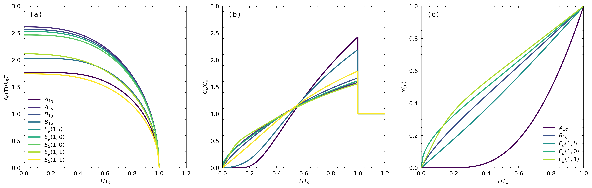

# gsplot 📈

<div align="center">
  
</div>

[](https://github.com/SoichiroYamane/gsplot/actions/workflows/gh-pages-sphinx.yml)


----------------

<div style="text-align: center; font-weight: bold; font-size: 1.2em; margin: 20px 0;">
  <a href="#docs" style="margin: 0 15px; text-decoration: none;">Docs</a> |
  <a href="#authors" style="margin: 0 15px; text-decoration: none;">Authors</a> |
  <a href="#license" style="margin: 0 15px; text-decoration: none;">License</a>
</div>

Welcome to **gsplot** (general-scientific plot), a toolkit designed to enhance the capabilities of data visualization based on [matplotlib](https://matplotlib.org). This package is specifically tailored for creating high-quality figures in aim to scientific field.

## Features ✨

- **Better Plot, Less Code**: Simplify the process of creating high-quality figures 💤
- **Compatibility**: Compatible with matplotlib 📊
- **Customization**: Customize your configuration to fit your needs 🎨
- **Reproducibility**: Save your package status 📦

### Example plot using gsplot 📈



### Example coding with Python REPL 🐍 and neovim 🌟

<style>
  .video-container {
    display: flex;
    justify-content: center;
    align-items: center;
    max-height: 300vh;
  }

  .responsive-video {
    max-width: 100%;
    height: auto;
  }
</style>

<div class="video-container">
  <video class="responsive-video" autoplay muted loop controls>
    <source src="docs/_static/repl_tutorial.mp4" type="video/mp4">
    Your browser does not support the video tag.
  </video>
</div>

## Getting Started 🚀

### Installation

To use **gsplot**, ensure that you have `Python 3.10+` installed. You can install the package using `pip`:

needs to be updated on python version

```bash
pip install gsplot
```

## Authors

- Giordano Mattoni
- Soichiro Yamane

## License

This project is licensed under the MIT License. See the [LICENSE](LICENCE) file for details.
