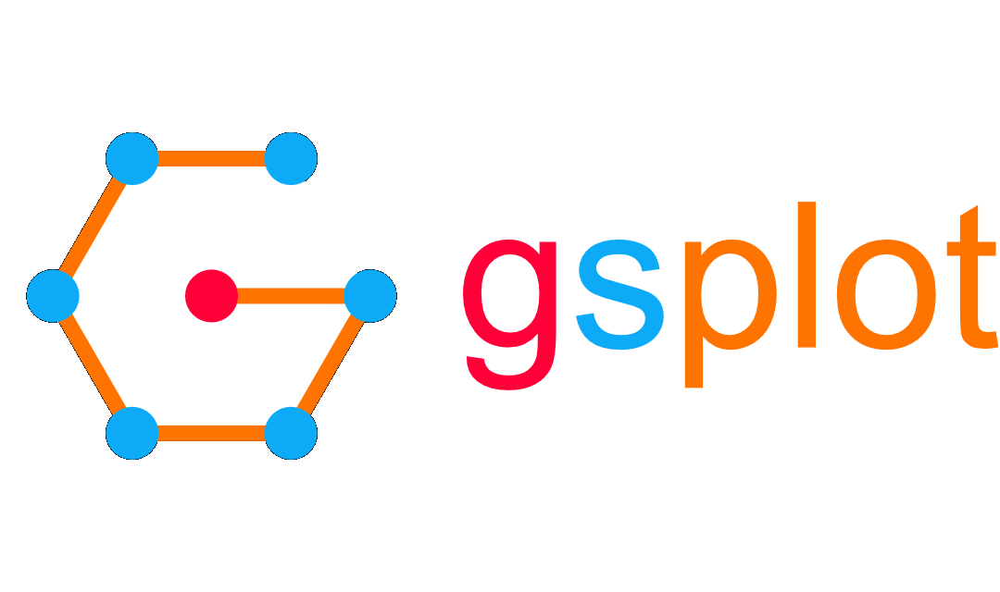

<div align="center">
  
</div>

[](https://soichiroyamane.github.io/gsplot/stable/)
[](https://pypi.org/project/gsplot/)
[](https://www.python.org/)
[](LICENSE)

# gsplot

`gsplot` creates publication-quality scientific figures with a concise API on
top of Matplotlib. It adds paper-aware layouts, deterministic plotting and
styling helpers, validated JSON defaults, and lightweight build metadata while
returning ordinary Matplotlib `Figure`, `Axes`, and Artist objects.

The package is still evolving. Check the [documentation](https://soichiroyamane.github.io/gsplot/stable/)
and the [issue tracker](https://github.com/SoichiroYamane/gsplot/issues) before
depending on behavior that is not covered by the public API.

## Install

`gsplot` supports Python 3.10 and newer:

```bash
python -m pip install gsplot
```

## Quick example

```python
import gsplot as gs

fig, axes = gs.subplots("AB")
gs.line(axes["A"], [0, 1, 2], [0, 1, 4], label="quadratic")
gs.scatter(axes["B"], [0, 1, 2], [0, 1, 4], label="samples", s=15)
gs.label(axes, "x", "value", square=True, index="in")
gs.legend(axes)
gs.save(fig, "quickstart", show=False)
```

This creates a two-panel Matplotlib figure, saves `quickstart.png` and
`quickstart.pdf`, and remains compatible with regular Matplotlib operations.

The canonical helpers always receive their Figure or Axes target explicitly.
`save` writes PNG and PDF transactionally at 600 DPI with a tight crop and
displays the Figure after successful writes by default; pass `show=False` for
batch or headless output. Use `crop=False` when output dimensions must match
the Figure design canvas exactly. The advanced `savefig` helper retains its
conservative output controls.

For a complete scientific example, see the
[paper-plot demo](https://soichiroyamane.github.io/gsplot/stable/guides/demo/4_paper_plot.html).

## Configuration

Configuration is optional and explicit. Load a schema-2 JSON file and pass the
immutable value to supported functions:

```python
import gsplot as gs

config = gs.load_config("path/to/gsplot.json")
fig, axes = gs.subplots(config=config)
```

When a value is specified more than once, the precedence is:

1. an argument passed directly to the function;
2. the supplied immutable `Config` value;
3. the function's default value.

Canonical code never searches the working directory or home directory for a
configuration file. See the [configuration guide](https://soichiroyamane.github.io/gsplot/stable/guides/demo/3_config.html)
for the supported schema, precedence, and backend notes.

## Development

The repository uses Poetry and targets Python 3.10 or newer. With a compatible
Python interpreter:

```bash
python -m pip install "poetry==2.4.1"
poetry install
MPLBACKEND=Agg poetry run pytest -q
MPLBACKEND=Agg poetry run sphinx-build -W -b html docs docs/_build/html
```

The demos under `demo/` are executable documentation. Run one from its own
directory, for example:

```bash
cd demo/1_axes && python axes.py
```

`demo/9_compatibility` intentionally demonstrates the deprecated 0.x surface.
All other plotting demos use the canonical explicit-target API.

See [the developer setup guide](docs/reference/contribution/developer_env.md)
for formatting, type checking, packaging, and Docker instructions.

For private vulnerability reports and the supported-version policy, see
[SECURITY.md](SECURITY.md).

## Authors

This repository was forked from code developed by Giordano Mattoni.

- Giordano Mattoni
- Soichiro Yamane

## License

This project is distributed under the [MIT License](LICENSE).
