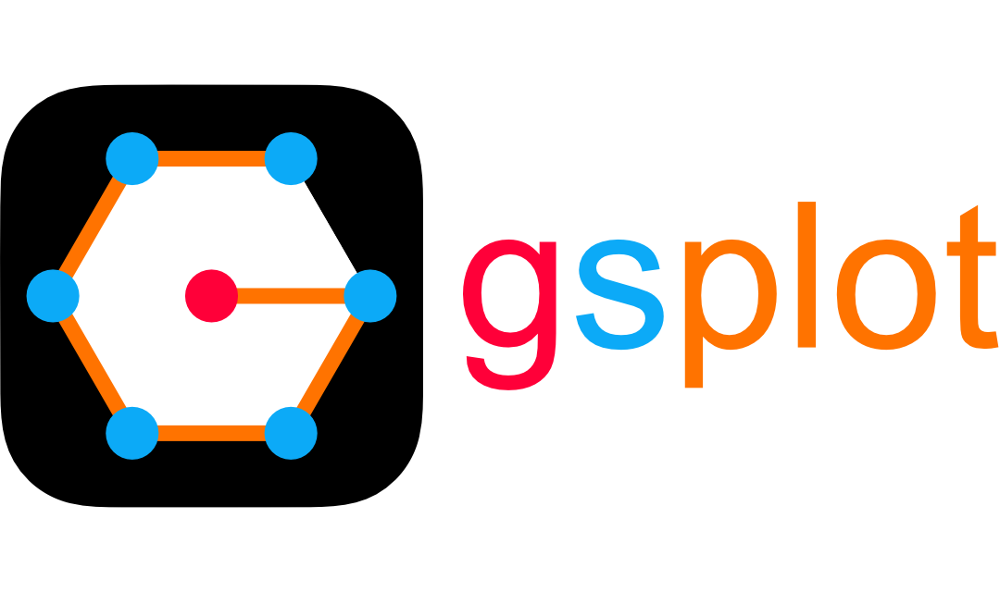

# 🏠 HOME

<div style="text-align: center; background-color: transparent;">
    
</div>

<p style="text-align: center;">
    <a href="./guides/start/getting_started.html" style="text-decoration: none;">
        <button style="
            background-color: #0078D7;
            color: white;
            font-size: 1.2em;
            padding: 10px 20px;
            border: none;
            border-radius: 5px;
            cursor: pointer;
            box-shadow: 0px 4px 6px rgba(0, 0, 0, 0.1);
            transition: all 0.3s ease;
        "
        onmouseover="this.style.backgroundColor='#005BBB'; this.style.boxShadow='0px 6px 8px rgba(0, 0, 0, 0.15)';"
        onmouseout="this.style.backgroundColor='#0078D7'; this.style.boxShadow='0px 4px 6px rgba(0, 0, 0, 0.1)';">
            🚀 Getting Started
        </button>
    </a>
</p>

## 🔎 Overview

Welcome to **gsplot** (general-scientific plot), a toolkit designed to enhance the capabilities of data visualization based on [matplotlib](https://matplotlib.org). This package is specifically tailored for creating high-quality figures aimed at the scientific field.

::: {warning}
This package is _beta_ quality. Expect breaking changes and many bugs 🐛. Please report any issue you encounter 🤝.
:::

## ✨ Features

- **Better Plot, Less Effort**: Effortlessly create high-quality figures ⚛️
- **Compatibility**: Fully compatible with [matplotlib](https://matplotlib.org) 📊
- **Customization**: Tailor configurations to suit your needs 🎨
- **Reproducibility**: Save package states for reproducible plots 📦

## 📈 Example using gsplot

<a href="./guides/demo/4_paper_plot.html"
   style="
      display: inline-block;
      padding: 8px 16px;
      font-size: 1em;
      font-weight: 500;
      color: #005BBB;
      background-color: #E8F4FF;
      text-decoration: none;
      border-radius: 4px;
      border: 1px solid #005BBB;
      transition: all 0.2s ease;
      margin-left: 0px;
   "
   onmouseover="this.style.backgroundColor='#D1E9FF'; this.style.color='#003E7F';"
   onmouseout="this.style.backgroundColor='#E8F4FF'; this.style.color='#005BBB';">
   ➡️ View the Sample Code
</a>

```{image} ../demo/4_paper_plot/SC_cal.png
:alt: SC_cal
:class: bg-primary
:width: 1500px
:align: center
```

```{toctree}
:hidden:
./guides/index.md
./reference/index.md
./api_reference/index.md
```
