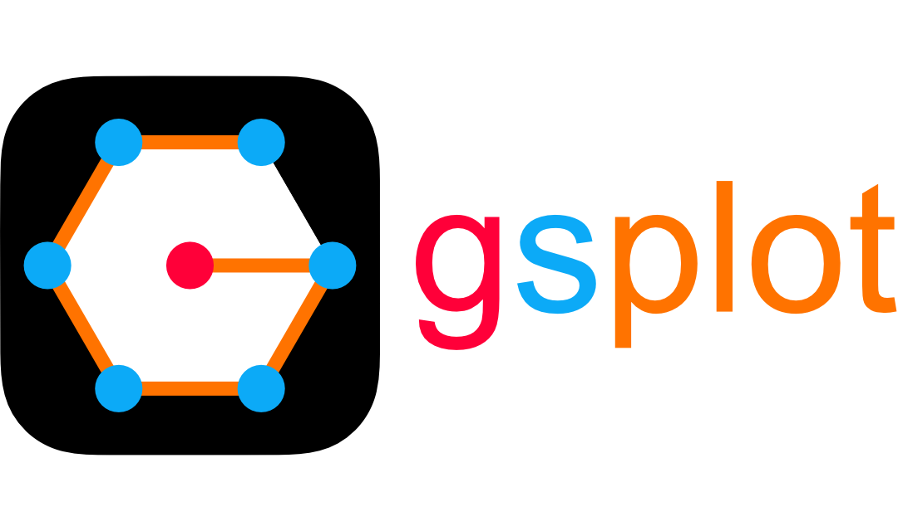

# HOME 🏠

<div style="text-align: center; background-color: transparent;">
    
</div>

<p style="text-align: center;">
    <a href="./guides/start/get_started.html" style="text-decoration: none;">
        <button style="
            background-color: #0078D7;
            color: white;
            font-size: 1.2em;
            padding: 10px 20px;
            border: none;
            border-radius: 5px;
            cursor: pointer;
            box-shadow: 0px 4px 6px rgba(0, 0, 0, 0.1);
            transition: all 0.3s ease;
        "
        onmouseover="this.style.backgroundColor='#005BBB'; this.style.boxShadow='0px 6px 8px rgba(0, 0, 0, 0.15)';"
        onmouseout="this.style.backgroundColor='#0078D7'; this.style.boxShadow='0px 4px 6px rgba(0, 0, 0, 0.1)';">
            Get Started 🚀
        </button>
    </a>
</p>

## Overview 🔎

Welcome to **gsplot** (general-scientific plot), a toolkit designed to enhance the capabilities of data visualization based on [matplotlib](https://matplotlib.org). This package is specifically tailored for creating high-quality figures aimed at the scientific field.

## Features ✨

- **Better Plot, Less Code**: Simplify the process of creating high-quality figures 💤
- **Compatibility**: Compatible with [matplotlib](https://matplotlib.org) 📊
- **Customization**: Customize your configuration to fit your needs 🎨
- **Reproducibility**: Save your package status and make plots reproducible 📦

## Example using gsplot 📈

[> Here is a sample code for this plot](./guides/demo/4_paper_plot.md)

```{image} ../demo/4_paper_plot/SC_cal.png
:alt: SC_cal
:class: bg-primary
:width: 1500px
:align: center
```

```{toctree}
:hidden:
./guides/index.md
./reference/index.md
./api_reference/index.md
```
